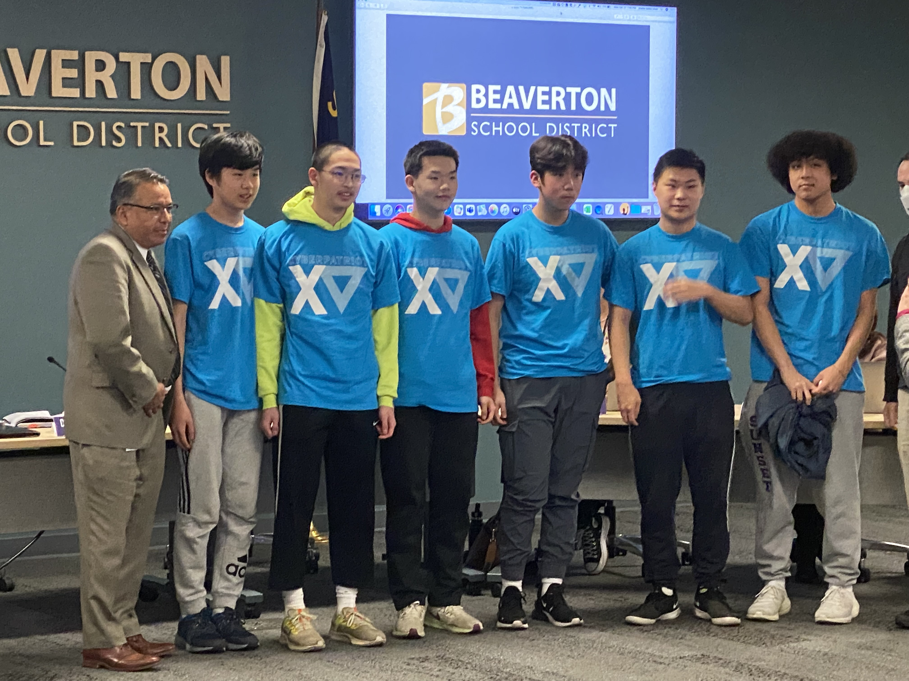

## [Home](./index.html) | [Apply](./apply.html) | [CyberCamp](./cybercamp.html) | **Blog** | [Contacts](./contacts.html) | [Resources](./resources.html) | [Tech Caregiver](./techcg.html) | [Events](./events.html)

## Recognition of Titanturtles Team at BSD Board Meeting

<iframe width="560" height="315" src="https://www.youtube.com/embed/QEbpzIMqRUA" title="YouTube video player" frameborder="0" allow="accelerometer; autoplay; clipboard-write; encrypted-media; gyroscope; picture-in-picture; web-share" allowfullscreen></iframe>

## SEMIFINAL COMPETITION JANUARY 21, 2023

## COMPETITIONS

Semifinals Awards:

State Round Awards for CyberPatriot Competition:

**Team 15-1766 TitanTurtles Roster (Global Platinum Tier #17, OR #1)**
 - Arnold Yang: 11th Grade              Westview High School              President: Westview CyberSecurity Club
 - Michael Xu: 11th Grade               Westview High School              Chief Networking Officer: Westview CyberSecurity Club
 - Sean Ji: 9th Grade                   Oregon Episcopal School           Vice President Windows: Team TitanTurtles
 - Kevin Yu: 11th Grade                 Sunset High School                Vice President Networking: Team TitanTurtles
 - Arthur Yang: 8th Grade               International School of Beaverton Vice President Linux System: Team TitanTurtles
 - Kevin Du: 9th Grade                  Catlin Gable                      Vice President Windows Server: Team TitanTurtles

**Team 15-1767 TitanTortoises Roster: (Global Platinum Tier #109, OR #3)**
 - Jerry Zhong: 9th Grade                  Westview High School              Vice President of Windows: Team TitanTortoises
 - Anya Li: 10th Grade                     International School of Beaverton Team Captain: Team TitanTortoises
 - Derek Zhao: 8th Grade                   Willamette Valley Academy         Vice President of Windows Server: Team TitanTortoises
 - Mandy Chang: 7th Grade                  Shahala Middle School             Vice President of Linux System: Team TitanTortoises
 - Nathan Chen: 11th Grade                 Camas High School                 Vice President of Linux Ubuntu: Team TitanTortoises
 - Ashton Jiang: 9th Grade                 Columbia River High School        Vice President of Cisco Networking: Team TitanTortoises

**Team 15-1769 TitanWugui Roster: (Global Platinum Tier #146, OR #4)**
 - Ethan Knapp: 9th Grade                 Westview High School              Vice President of Linux System: Team TitanWugui
 - Michael Fu: 9th Grade                  Sunset High School                Team Captain: Team TitanWugui
 - Yedong Yu: 8th Grade                   Stoller Middle School             Vice President of Linux System: Team TitanWugui
 - John Kong: 7th Grade                   Willamette Valley Academy         Chief Networking Officer: Team TitanWugui
 - Devin Chen: 9th Grade                  Lake Oswego High School           Vice President of Networking: Team TitanWugui
 - Luke Zhang: 9th Grade                  Lincoln High School               Vice President of Windows Server: Team TitanWugui

 **Team 15-1768 TitanTortugas Roster: (Global Platinum Tier #156, OR #5)**
 - Ammar Mukadam: 11th Grade                   Westview High School                         Co-Captain: Team TitanTortugas
 - Owen Gifford: 11th Grade                    Westview High School                         Co-Captain: Team TitanTortugas
 - Virinchi Vanjarapu: 11th Grade              Westview High School                         Chief Networking Officer: Team TitanTortugas
 - Issac Loo: 11th Grade                       Westview High School                         Vice President Networking: Team TitanTortugas
 - Siddesh Mangipudi: 12th Grade               Westview High School                         Vice President Windows: Team TitanTortugas
 - Yuma Endo: 9th Grade                        Westview High School                         Vice President Linux: Team TitanTortugas

 **Team 15-1839 TitanKacchuas Roster: (Global Gold Tier #482, OR #1)**
 - Taafeef Khayer: 8th Grade                  Tumwater Middle School                        Captain: Team TitanKacchuas
 - Meet Raval: 11th Grade                     Westview High School
 
Titanturtles Club organized five teams to participate in 2022-2023 US Cyber Patriot competition:

15-1766 Titanturtles

15-1767 Titantortoises

15-1769 Titanwugui

15-1768 Titantortugas

15-1839 Titankachhuas

### CYBERPATRIOT 2022-2023 ROUND 4 (SEMIFINAL ROUND) COMPETITION: JAN 21, 2023
The semifinal round is what determines whether, the teams make Nationals. Although, the images have various predetermined rankings, all were super hard, only Ubuntu was hard, we can gain a more accurate understanding of the image difficulty by looking at the public scores. Fedora in this case was Extremely hard, as 99% of teams got less than 10 points on it. Ubuntu although now only marked hard, was harder than the State Round Ubuntu which was marked superhard. Windows and Windows Server were relatively easier and was where all the points were got. The Boeing Challenge were points that team's must obtain, the web challenge had one super hard part and a relatively easier part. The Cisco Networking Quiz was easy, but the packet tracer was super hard.

### CYBER PATRIOT 2022-2023 ROUND 3 (STATE ROUND) COMPETITION: DEC 10-11, 2022

State Round competition is at a premium level. Windows 10 images is medium. Windows Server 2019 image is hard. Ubuntu 20 is super hard. Team 15-1766 Titanturtles scored 271 total score, harvested Oregon first place champion in High School Open Division Platinum Tier and ranked #17 out of 630 High School Open Division Platinum Tier teams all over the world.

### CYBER PATRIOT 2022-2023 ROUND 2 COMPETITION: NOV 5-6, 2022

Four of five teams improved their High School Open Division Ranking in Round 2 and advanced to Platinum Tier of next round of competition.. Team 15-1839 Titankachhuas will compete within Gold Tier in Round 3

### CYBER PATRIOT 2022-2023 ROUND 1 COMPETITION: OCT 20-22, 2022 

All five teams achieved outstanding results during round 1. Team 15-1766 Titanturtles scored perfect scores on Windows 10, Windows Server 19, Ubuntu images and scored 28.86 out of 30 on Cisco networking. Titanturtles team ranked #1 in Oregon and #19 out of 2,092 teams in High School Open Division.

Team members of 15-1766:

Arnold Yang (Team Captain)

Arthur Yang (Vice President of Linux Operating System)

Sean Ji (Vice President of Windows system)

Kevin Du (Vice President of Windows Server)

Michael Xu (Chief Networking Officer)

Kevin Yu (Vice President of Cisco Networking)

