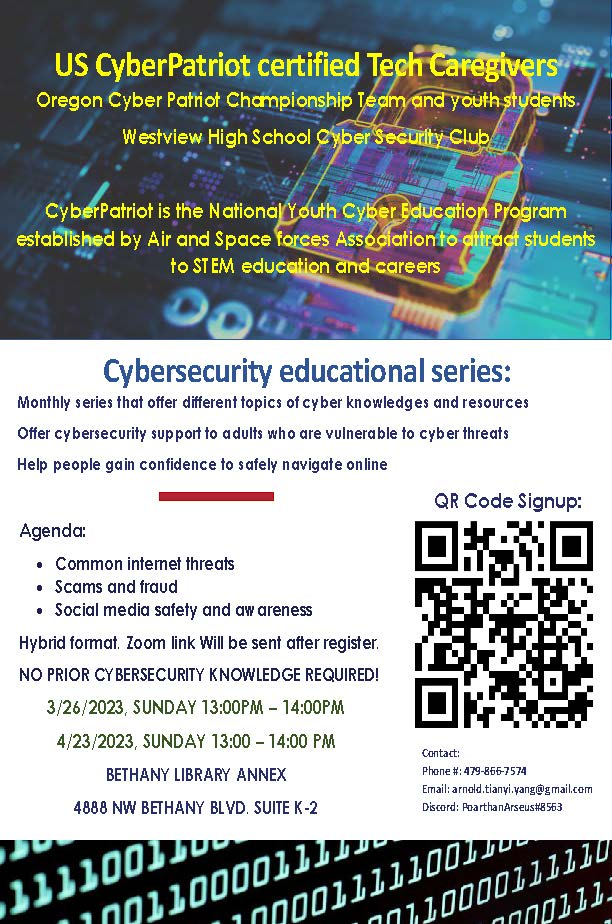
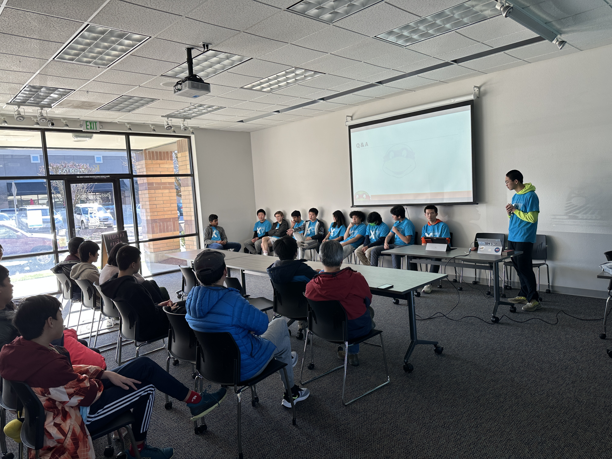
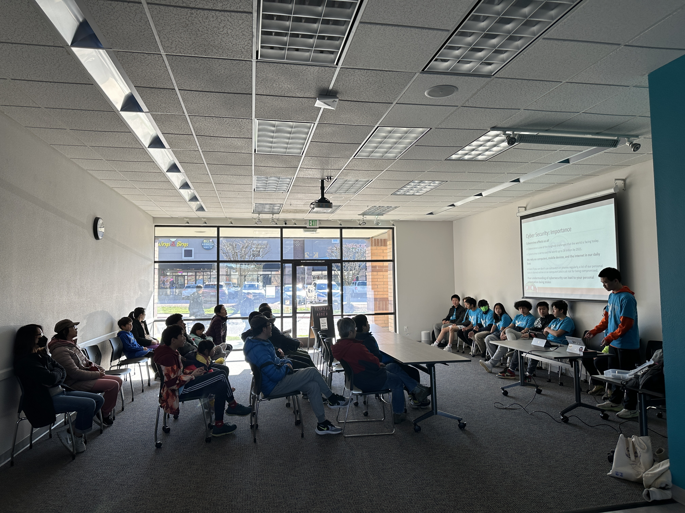
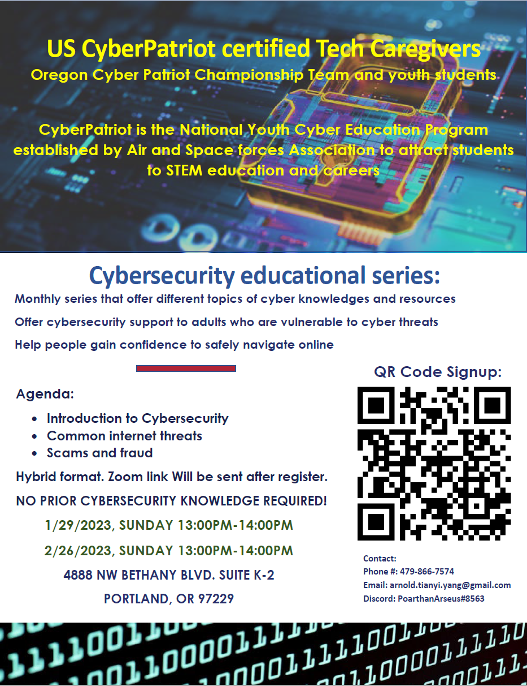
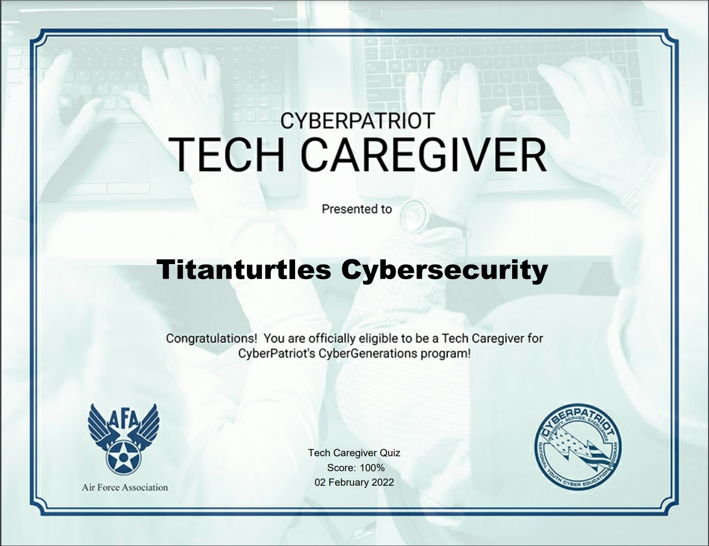

## [Home](./index.html) | [Apply](./apply.html) | [CyberCamp](./cybercamp.html) | [Blog](./blog.html) | [Contacts](./contacts.html) | [Resources](./resources.html) | **Tech Caregiver | [Events](./events.html)**

# Community Education

**February 26, 2023 Community Education Flyer**

**January 29, 2023 Titanturtles Club Community Education event**
**CyberSecurity 101 and Password Policy

# Tech Caregiver
Tech Caregiver is a CyberPatriot Cybergenerations program with the goal of educating the community about cybersecurity threats and ways we can protect ourselves.

Titanturtles is officially certified by the Tech Caregiver's Program:

